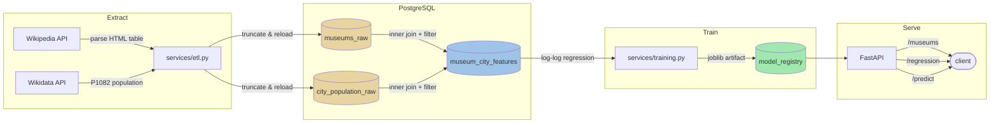

# Museum Visitor Analysis

Hello dear reviewer, thank you for taking some time to look at my work !

## Design Decisions

| Decision | Rationale | Trade-off |
|----------|-----------|-----------|
| **PostgreSQL only** | Standard database backend simplifies upsert logic, migrations, and deployment | Requires Docker or a PG instance for all environments (vs. sqlite) |
| **Alembic migrations** | Versioned, replayable schema changes | Extra file overhead vs. plain create_all |
| **Wikidata P1082 for population** | Structured, auto-updating, the canonical source | API may be slow/unreachable |
| **Bronze/silver table pattern** | Clean data lineage; raw tables preserved for reprocessing | More tables than a single normalized schema |
| **Model registry + joblib** | Versioned models, metrics tracked, easy rollback | Adds filesystem dependency; production would use Mlflow + S3/GCS |
| **FastAPI** | Auto OpenAPI docs, Pydantic validation, async-ready | Heavier than Flask for 3 endpoints; pays off via /docs |
| **pandas `read_html`** | Leverages existing pandas dep for table parsing; `extract_links` preserves hrefs | Needs lxml backend; less flexible than a full scraping library |

### Known Limitations

- **Small sample** (42 museums) limits statistical significance
- **Confounders not modeled** — tourism infrastructure, free admission, GDP, reputation, city-level aggregation
- **Wikipedia table format** can change; parser needs maintenance
- **No API authentication** — add API keys or OAuth for public deployment
- **Truncate-and-reload ETL** — acceptable for this dataset size; production would use incremental loads

## Reproducing results

### Option 1. Docker

```bash
docker compose up --build
```

| Service | URL | Purpose |
|---------|-----|---------|
| `postgres` | localhost:5432 | PostgreSQL 16 |
| `pipeline` | (runs once) | ETL + feature build + model training |
| `api` | <http://localhost:8000> | REST API (OpenAPI docs at /docs) |
| `notebook` | <http://localhost:8888> | Jupyter notebook |

## API

```bash
curl http://localhost:8000/museums          # list museums + city population
curl http://localhost:8000/regression       # model summary (R², RMSE, equation)
curl -X POST http://localhost:8000/predict \
     -H "Content-Type: application/json" \
     -d '{"population": 5000000}'           # predict visitors
```

## Architecture



### Module map

I used a standard layered architecture:

```
src/wikiapp/
├── config.py              # Settings from env vars (DATABASE_URL, etc.)
├── clients/
│   ├── wikipedia.py       # Wikipedia API → museum list (pandas read_html)
│   └── wikidata.py        # Wikidata P1082 → city population
├── repositories/
│   ├── museums.py         # museums_raw table operations
│   ├── populations.py     # city_population_raw table operations
│   ├── features.py        # museum_city_features table operations
│   └── models.py          # model_registry table operations
├── services/
│   ├── etl.py             # Ingest museums + enrich population
│   ├── transform.py       # Join raw tables → museum_city_features
│   └── training.py        # Train, persist (joblib), register model
├── db.py                  # SQLAlchemy engine, sessions, Alembic migrations
├── api.py                 # FastAPI (museums, regression, predict)
├── schemas.py             # Pydantic request/response models
└── cli.py                 # CLI with subcommands
```

### Database schema (4 tables)

- **museums_raw** — raw museum data from Wikipedia (name, city, visitors, year)
- **city_population_raw** — population from Wikidata (city, population, as_of date)
- **museum_city_features** — joined analytical table for ML
- **model_registry** — versioned model metadata (R², RMSE, MAE, artifact path)

Managed by Alembic migrations.

## Testing

```bash
python -m pytest -v
```

Tests cover the Wikipedia/Wikidata clients and data parsing.
